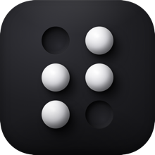

<div align="center">



# Tactile

**Feel the interface, not just see it.**

Tactile is a macOS menu-bar utility that taps your Force Touch trackpad's haptic
motor whenever the cursor passes over something clickable, in any app,
system-wide. Built as an accessibility aid: instead of relying on the subtle
hover-color change most apps use, you *feel* a physical tick under your finger
when the cursor reaches a button, link, checkbox, menu, or tab.


</div>


## Install: [https://github.com/Mason363/Tactile/releases](https://github.com/Mason363/Tactile/releases)


<br>

https://github.com/user-attachments/assets/b410fdf5-21cd-40d7-971e-5c15e5669e02

> https://www.youtube.com/watch?v=uhJYkYtZ8AE

## How it works

Tactile reads the same macOS Accessibility tree that VoiceOver uses. A global
mouse monitor watches cursor movement, a background hit-tester asks the system
what element is under the cursor, and when the cursor enters a clickable
element, the trackpad ticks once.

The pipeline is fully event-driven: when the mouse is still, Tactile does
nothing at all (0% CPU). While moving, sampling is throttled and cached
per-element, so continuous use stays under a few percent of one core.

## Features

- **Works everywhere**: native apps, Finder (files, folders, sidebar, and
  desktop icons), browsers, and Electron apps; anything that exposes an
  accessibility tree.
- **Chrome browser bridge (optional)**: a companion extension reads the real
  page DOM, so `<div>`-style buttons that never reach the accessibility tree
  still tick. See [`extension/`](extension/).
- **Haptic waveforms**: every feel is a composable waveform: pick a preset
  (taps, double/triple tap, ramps, shake, heartbeat) or compose your own pulse
  by pulse, per element type.
- **Contextual danger feel**: window close buttons and controls labeled
  Delete/Remove/Reset/etc. play their own warning waveform.
- **State awareness**: checked checkboxes and the selected tab add a
  confirmation pulse; optionally feel disabled controls as a dull tap.
- **Hover-out feel**: a separate waveform when leaving a control, so you can
  feel its extent.
- **Spatial feedback**: optional bumps at outer screen edges and when the
  cursor crosses window boundaries.
- **Visual aids**: a colored circle that rides under the cursor (green over
  clickable, red over destructive) and an outline around the hovered element,
  for low-vision use. Colors are configurable.
- **Enhanced haptics (optional)**: drives the trackpad actuator directly so
  Light/Standard/Firm become physically different strengths. Uses a private
  system framework, loaded at runtime with automatic fallback to standard
  haptics if it's ever unavailable.
- **Continuous vibration**: with enhanced haptics on, keep the trackpad
  buzzing while the cursor rests on a control, fast enough (up to 250 pulses/s)
  to feel like a true vibration rather than a series of taps.
- **Custom sounds**: an optional click for external-mouse users; use a
  built-in sound or import your own.
- **Profiles & import/export**: save named snapshots of your whole setup,
  switch from the menu bar, and share configurations as JSON.
- **Playground**: real sample controls to feel your configuration live while
  tuning it.
- **Per-app exclusions, rate limiting, dwell delay, No Lag mode, launch at
  login, one-click pause**: the usual knobs for taste and battery.
- **Keyboard haptics**: tick on shortcuts, every key, modifiers, or your own
  recorded key combinations, each with its own waveform.
- **Automatic updates**: via [Sparkle](https://sparkle-project.org).

## Accessibility

Tactile can also be used as a low-vision aid. Beyond the haptic feedback, it adds
visual reinforcement for anyone who has trouble tracking a small cursor or
telling what's interactive on screen:

- **Element highlighting** — an outline traces the exact control under the
  cursor, so buttons, links, and fields are unambiguous even at a glance.
- **Crosshair** — a large crosshair easier to keep track of pointer position on screen.
- **Hover circle** — a colored circle rides under the cursor (green over
  clickable, red over destructive), reinforcing *what kind* of element you're
  on before you click.
- **Labeled elements** - a small label that gives information on the hovered element, such as it's type (link, button, toggle, etc) and where it is from (menu bar, apps, dock, etc).

Together with the haptic tick, this gives low-vision users three independent
signals — feel, color, and shape — for the same event.

### Crosshair
https://github.com/user-attachments/assets/39e714b6-001d-41fa-ad16-dd00278f0ac2

### Crosshair & Label
https://github.com/user-attachments/assets/3d63dd16-311b-4e34-bc6e-0c753deea56e

### Element Highlighting
https://github.com/user-attachments/assets/be978b1a-c9f5-4f8b-85c8-eac8164a2af8

### Hover Circle
https://github.com/user-attachments/assets/32005d36-5cf8-4fb2-bb97-1f0e5bf81fd9

To enable these, go to Tactile Settings -> visual aids


## Requirements

- A Mac with a Force Touch trackpad (built-in on modern MacBook Pro/Air, or a
  Magic Trackpad). Haptics are felt while a finger rests on the trackpad, which
  is naturally the case while using it. External mice can use the click sound.
- macOS 14.6 or later.
- The **Accessibility** permission (System Settings → Privacy & Security →
  Accessibility). Tactile walks you through this on first launch.

## Install

1. Download `Tactile.app` from the [latest release](https://github.com/Mason363/Tactile/releases/latest) and drag it to `/Applications`.
2. **Tactile is not yet notarized by Apple**, so Gatekeeper will refuse to open
   it on first launch (“Tactile can’t be opened because Apple cannot check it
   for malicious software”). Clear the quarantine flag once, in Terminal:

   ```sh
   xattr -dr com.apple.quarantine /Applications/Tactile.app
   ```

   Then open it normally. (You only need to do this once. It's the standard
   step for open-source Mac apps distributed without a paid notarization
   subscription, the full source is here for you to inspect or build yourself.)
3. Launch Tactile, grant the Accessibility permission when prompted, and you're
   set. The icon lives in the menu bar.

### Chrome extension (optional)

For web pages, load the companion extension for richer coverage; see
[`extension/README.md`](extension/README.md). Then enable **Browser
integration** in Settings → Apps & Browser.

## Building

Open `Tactile.xcodeproj` in Xcode and run. Package dependencies (Sparkle)
resolve automatically. The app is unsandboxed, the system-wide Accessibility
API requires it, so it isn't App Store distributable; distribute with Developer
ID signing and notarization.

## Releasing (maintainers)

Automatic updates use Sparkle and are driven by
[`appcast.xml`](appcast.xml) at the repo root (the feed URL is set in
`Info.plist` → `SUFeedURL`). One-time setup, then per-release steps:

**One time: signing keys**

1. Run Sparkle's `generate_keys` (bundled with the Sparkle package /
   [release tools](https://github.com/sparkle-project/Sparkle/releases)). It
   stores a private key in your login Keychain and prints a public key.
2. Paste that public key into `Info.plist` → `SUPublicEDKey`, and commit.

**Each release**

1. Bump `MARKETING_VERSION` and `CURRENT_PROJECT_VERSION` in the project.
2. Archive, export with Developer ID, **notarize**, and zip the `.app`.
3. Sign the zip: `sign_update Tactile-x.y.z.zip` → copies an `edSignature`.
4. Add an `<item>` to `appcast.xml` with `<enclosure url="…" length="…"
   sparkle:edSignature="…"/>` pointing at the zip on the GitHub release, bump
   `sparkle:version`/`shortVersionString`, and push.

Users then get the update in-app via **Check for Updates…** or the background
check.

## Privacy & safety

- **No network access of its own.** Tactile makes exactly one kind of outbound
  request, the Sparkle update check to this repository, and nothing else. It
  has no analytics, no telemetry, and collects nothing.
- **On-device only.** The Accessibility permission is used solely to identify
  the *kind* of UI element under the cursor (button, link, …), never your
  content, and never keystrokes.
- **Local IPC only.** The optional browser bridge talks to the extension over a
  local Unix socket in your Application Support folder, never over the network.
- **Auditable.** The one private API (the trackpad actuator, via
  MultitouchSupport) is loaded at runtime with `dlopen` and falls back safely;
  everything else is public API. The whole source is here.

## License

[MIT](LICENSE) © Mason Chen
