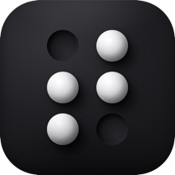

# Tactile

**Feel the interface, not just see it.**

Tactile is a macOS menu-bar utility that taps your Force Touch trackpad's haptic
motor whenever the cursor passes over something clickable, in any app,
system-wide. Built as an accessibility aid: instead of relying on the subtle
hover-color change most apps use, you *feel* a physical tick under your finger
when the cursor reaches a button, link, checkbox, menu, or tab.

## Install: [https://github.com/Mason363/Tactile/releases](https://github.com/Mason363/Tactile/releases)

 

https://github.com/user-attachments/assets/b410fdf5-21cd-40d7-971e-5c15e5669e02

> https://www.youtube.com/watch?v=uhJYkYtZ8AE

## How it works

Tactile reads the same macOS Accessibility tree that VoiceOver uses. A global
mouse monitor watches cursor movement, a background hit-tester asks the system
what element is under the cursor, and when the cursor enters a clickable
element, the trackpad ticks once.

The pipeline is fully event-driven: when the mouse is still, Tactile does
nothing at all (0% CPU). While moving, sampling is throttled and cached
per-element, so continuous use stays under a few percent of one core.

## Features

- **Works everywhere**: native apps, Finder (files, folders, sidebar, and
  desktop icons), browsers, and Electron apps; anything that exposes an
  accessibility tree.
- **Chrome browser bridge (optional)**: a [companion extension](https://chromewebstore.google.com/detail/bkpkcddffbjipobgjlagggbbldefpldo?utm_source=item-share-cb)
  reads the real page DOM, so `
`-style buttons that never reach the
  accessibility tree still tick. Source in [`extension/`](extension/).
- **Haptic waveforms**: every feel is a composable waveform: pick a preset
  (taps, double/triple tap, ramps, shake, heartbeat, ring) or compose your own
  step by step, per element type. Any step can be a tap or a held note with
  its own pitch and length, played by the trackpad's motor as a real tone.
- **Contextual danger feel**: window close buttons and controls labeled
  Delete/Remove/Reset/etc. play their own warning waveform.
- **State awareness**: checked checkboxes and the selected tab add a
  confirmation pulse; optionally feel disabled controls as a dull tap.
- **Hover-out feel**: a separate waveform when leaving a control, so you can
  feel its extent.
- **Spatial feedback**: optional bumps at outer screen edges and when the
  cursor crosses window boundaries.
- **Visual aids**: a colored circle that rides under the cursor (green over
  clickable, red over destructive) and an outline around the hovered element,
  for low-vision use. Colors are configurable.
- **Enhanced haptics (optional)**: drives the trackpad actuator directly so
  Light/Standard/Firm become physically different strengths. Uses a private
  system framework, loaded at runtime with automatic fallback to standard
  haptics if it's ever unavailable.
- **Continuous vibration**: with enhanced haptics on, the trackpad holds a
  real note while the cursor rests on a control, at a pitch you choose from a
  deep hum to a fine buzz, shaped as steady, pulses, or a heartbeat.
- **iPhone as the haptic device (via [Coast](https://coast.masn.studio))**:
  when Coast connects an iPhone to your Mac, the phone shows up in the device
  chooser and every tick plays in your hand through its Taptic Engine: ideal
  when the phone itself is your mouse. The two apps talk over a local socket
  only, and feedback returns to the trackpads whenever the phone drops away.
- **Custom sounds**: an optional click for external-mouse users; use a
  built-in sound or import your own.
- **Profiles & import/export**: save named snapshots of your whole setup,
  switch from the menu bar, and share configurations as JSON.
- **Playground**: real sample controls to feel your configuration live while
  tuning it.
- **Per-app exclusions, rate limiting, dwell delay, No Lag mode, launch at
  login, one-click pause**: the usual knobs for taste and battery.
- **Keyboard haptics**: tick on shortcuts, every key, modifiers, or your own
  recorded key combinations, each with its own waveform.
- **Feel the music**: the trackpad plays whatever your Mac is playing. Its
  haptic motor sounds the music's own notes under your finger, up to five at
  once, with the bass folded up an octave the way a small speaker plays it,
  and it follows the music's loudness. It works the same for any kind of
  music, while talk and podcasts stay still. It pauses during calls and can
  rest while you use the cursor. Everything is lined up with your speakers or
  Bluetooth headphones automatically.
- **Sound alerts**: for sounds you might not hear. Feel an app start making
  sound, each app with its own pattern: an incoming FaceTime, Zoom, or Teams
  call rings on the trackpad until you switch to it. Notification banners and
  the charger connecting have their own feel too.
- **Languages**: English and Simplified Chinese (简体中文). Tactile follows
  your Mac's language list, or pick one in Settings → General. Adding a
  language is a resource folder; see [`docs/localization.md`](docs/localization.md).
- **Automatic updates**: via [Sparkle](https://sparkle-project.org).

## Accessibility

Tactile can also be used as a low-vision aid. Beyond the haptic feedback, it adds
visual reinforcement for anyone who has trouble tracking a small cursor or
telling what's interactive on screen:

- **Element highlighting**: an outline traces the exact control under the
  cursor, so buttons, links, and fields are unambiguous even at a glance.
- **Crosshair**: a large crosshair easier to keep track of pointer position on screen.
- **Hover circle**: a colored circle rides under the cursor (green over
  clickable, red over destructive), reinforcing *what kind* of element you're
  on before you click.
- **Labeled elements**: a small label that gives information on the hovered element, such as its type (link, button, toggle, etc) and where it is from (menu bar, apps, dock, etc).

Together with the haptic tick, this gives low-vision users three independent
signals (feel, color, and shape) for the same event.

For hard-of-hearing users, Tactile turns sounds into touch: a call rings on the
trackpad with its own pattern and keeps ringing until you switch to the app,
notification banners knock, plugging in the charger ramps up, and any music
can be felt as it plays, through the trackpad itself. Turn these on in
Tactile Settings -> Alerts and Music.

### Crosshair
https://github.com/user-attachments/assets/39e714b6-001d-41fa-ad16-dd00278f0ac2

### Crosshair & Label
https://github.com/user-attachments/assets/3d63dd16-311b-4e34-bc6e-0c753deea56e

### Element Highlighting
https://github.com/user-attachments/assets/be978b1a-c9f5-4f8b-85c8-eac8164a2af8

### Hover Circle
https://github.com/user-attachments/assets/32005d36-5cf8-4fb2-bb97-1f0e5bf81fd9

To enable these, go to Tactile Settings -> visual aids

## Requirements

- A Mac with a Force Touch trackpad (built-in on modern MacBook Pro/Air, or a
  Magic Trackpad). Haptics are felt while a finger rests on the trackpad, which
  is naturally the case while using it. External mice can use the click sound.
- macOS 14.6 or later.
- The **Accessibility** permission (System Settings → Privacy & Security →
  Accessibility). Tactile walks you through this on first launch.
- Optional, for Feel the Music only: the **System Audio Recording** permission
  (System Settings → Privacy & Security → Screen & System Audio Recording,
  under System Audio Recording Only). Tactile asks when you turn it on.

## Install

1. Download `Tactile.app` from the [latest release](https://github.com/Mason363/Tactile/releases/latest) and drag it to `/Applications`.
2. Launch Tactile, grant the Accessibility permission when prompted, and you're
   set. The icon lives in the menu bar.

Tactile is notarized by Apple, so it opens normally with no Gatekeeper
workaround. The whole source is here for you to inspect or build yourself.

### Chrome extension (optional)

For web pages, install the companion extension for richer coverage: it picks up
custom buttons the app would otherwise miss in the browser. Get it from the
[Chrome Web Store](https://chromewebstore.google.com/detail/bkpkcddffbjipobgjlagggbbldefpldo?utm_source=item-share-cb)
(or build from source; see [`extension/README.md`](extension/README.md)). Then
enable **Browser integration** in Settings → Apps & Browser.

## Building

Open `Tactile.xcodeproj` in Xcode and run. Package dependencies (Sparkle)
resolve automatically. The app is unsandboxed, the system-wide Accessibility
API requires it, so it isn't App Store distributable; distribute with Developer
ID signing and notarization.

## Releasing (maintainers)

Automatic updates use Sparkle and are driven by
[`appcast.xml`](appcast.xml) at the repo root (the feed URL is set in
`Info.plist` → `SUFeedURL`). One-time setup, then per-release steps:

**One time: signing keys**

1. Run Sparkle's `generate_keys` (bundled with the Sparkle package /
   [release tools](https://github.com/sparkle-project/Sparkle/releases)). It
   stores a private key in your login Keychain and prints a public key.
2. Paste that public key into `Info.plist` → `SUPublicEDKey`, and commit.

Ship the public key in a release that keeps the previous Apple code-signing
identity. Existing installations do not trust a newly added Sparkle key until
they have installed it once. If the Apple code-signing identity must change at
the same time, first publish a bridge update signed with the old identity and
containing the new public key. Add `sparkle:minimumAutoupdateVersion` to the
later update so older builds install the bridge first.

**Each release**

1. Bump `MARKETING_VERSION` and `CURRENT_PROJECT_VERSION` in the project.
2. Archive, export with Developer ID, **notarize**, and zip the `.app`.
3. Sign the zip: `sign_update Tactile-x.y.z.zip` → copies an `edSignature`.
4. Add an `<item>` to `appcast.xml` with `<enclosure url="…" length="…"
   sparkle:edSignature="…"/>` pointing at the zip on the GitHub release, bump
   `sparkle:version`/`shortVersionString`, and push.

Users then get the update in-app via **Check for Updates…** or the background
check.

## Privacy & safety

- **No network access of its own.** Tactile makes exactly one kind of outbound
  request, the Sparkle update check to this repository, and nothing else. It
  has no analytics, no telemetry, and collects nothing.
- **On-device only.** The Accessibility permission is used solely to identify
  the *kind* of UI element under the cursor (button, link, …), never your
  content, and never keystrokes.
- **Music is heard, never recorded.** Feel the Music analyzes system audio live,
  in memory, to find the notes and loudness to play; nothing is recorded, stored, or sent, and it
  only listens while something plays. Sound alerts don't touch audio at all:
  they read Core Audio's record of which apps are playing. Notification
  haptics notice that a banner appeared, never what it says.
- **Local IPC only.** The optional browser bridge talks to the extension over a
  local Unix socket in your Application Support folder, never over the network.
  The optional Coast link (iPhone haptics) has the same shape: a local socket
  to the Coast app on this Mac; any networking to the phone is Coast's, not
  Tactile's.
- **Auditable.** The few private functions (the trackpad actuator via
  MultitouchSupport, the System Audio Recording permission check, and matching
  an app's audio helper to the app) are loaded at runtime with `dlopen` and
  fall back safely; everything else is public API. The whole source is here.

## License

[MIT](LICENSE) © Mason Chen
